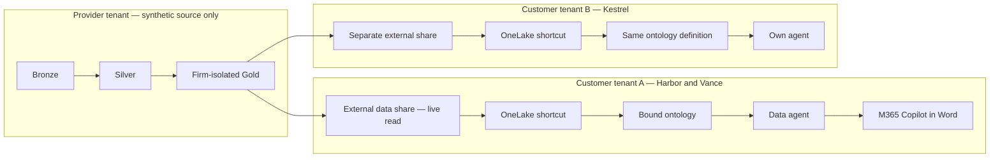

# One ontology, many law-firm tenants

An ISV can publish well-formed tables and still leave a customer's Copilot unable to
explain what a number means. A CFO calls a draft-bill reduction a write-down and an
issued-bill reduction a write-off; a generic join can blur the two. Worse, an agent
can confidently surface a matter from which the asking partner is screened. This
synthetic Microsoft Fabric workshop makes the vocabulary, calculation boundaries,
relationships, and authorization obligations explicit before asking an AI to answer.

The intended pattern is a governed ISV data product, a portable business ontology,
and customer-owned agents. Harbor & Vance LLP and Kestrel Legal instantiate the same
definition against distinct data. An ontology complements—not replaces—a semantic
model and data-plane authorization. Its distinctive contribution here is explaining
*where* value was lost along Adjustment → Proforma → Invoice → Matter → PracticeGroup.

## What this demo shows

Alexandra Reyes is the fictional Harbor & Vance Corporate partner. The five workshop
questions are designed to make both useful reasoning and the limits of a prototype visible.

| Question | Expected answer | Architectural claim |
|---|---|---|
| How much unbilled time is sitting on the Meridian acquisition matter, and how old is it? | Material unbilled WIP aged 60–120 days; separate time from costs and state currency and as-of date. | Shared business measures, not an improvised sum. |
| Which of my matters are over budget this quarter, and by how much? | Castellan tribunal series about 35%; lease renegotiations about 8%; compare fees and hours within the same quarter. | Partner roles, periods, and budgets are explicit. |
| Why did realization fall in the litigation group last month? | Distinguish Vantage proforma write-downs from Redgrave invoice write-offs; compare matched cohorts with the preceding month. An invoice write-off reduces recoverability, not already issued billed realization. | Stage-aware reasoning and no double-counting. |
| Draft a paragraph summarising the billing position on this matter. | A factual Meridian paragraph with as-of date, currency, WIP, billed, collected, outstanding, and citations; no invented amounts. | Contextual drafting grounded in governed definitions. |
| Show me the same thing for the Ashworth matter. | Refuse without revealing financials, narrative, or inferred matter attributes. | Authorization is enforced below the prompt; refusal alone is not proof of a secure data plane. |

Exact reproducible values are calculated from generated data, not hard-coded into
agent answers. The fixed default snapshot is **2026-09-04**; “last month” is August
2026 and “this quarter” starts July 1. Moving the snapshot requires explicit regeneration.

## Architecture and truth boundaries



There is an important distinction between the business aspiration and this topology:
external sharing reads provider-hosted data across a tenant boundary. It does **not**
prove that all firm data has always stayed inside the firm's tenant. This repository
uses synthetic provider data only; it contains no provider-side query of customer-owned
operational data. For a strict customer-only residency design, ingest and transform
inside each customer tenant and distribute definitions instead of provider-hosted data.
Microsoft's AI processing region settings also require a separate residency review.

Full isolation for two independent customer tenants requires **three tenants** (provider
plus two consumers). Two tenants support the provider and one external customer, or
two customer workspaces sharing a consumer tenant; the latter proves workspace, not
cross-customer tenant isolation. Single-tenant simulation is always explicitly labeled.

## Prerequisites and status

Python 3.11 or newer and Git are sufficient for local generation and tests. Live use
requires paid Fabric capacity that supports the selected previews, capacity assignment
rights, tenant-approved service principals, separate customer identities, and appropriate
Fabric and Microsoft 365 Copilot entitlements. See [the deployment guide](docs/03-deployment-guide.md)
for the permission matrix, tenant settings, preview contracts, and blocking checks.

The target APIs are verified against public Microsoft documentation dated **2026-09-04**.
Local tests and dry-run plans are not a live deployment certificate. External-share
acceptance, authorization compatibility, graph refresh, and Word publishing must not be
represented as automated unless their documented contracts support it. Unsupported
steps stop with a named gap; there is no silent copy or prompt-only security fallback.

## Quickstart

From this repository directory on Windows:

```powershell
./scripts/setup.ps1
./scripts/run_all.ps1 -DryRun
```

On macOS or Linux:

```bash
bash scripts/setup.sh
bash scripts/run_all.sh --dry-run
```

The setup scripts create a local virtual environment and install pinned dependencies.
The run scripts generate data, run tests, and plan the deployment. For live execution,
copy `.env.example` to `.env`, configure tenant-owned credentials privately, and run:

```powershell
./.venv/Scripts/python.exe scripts/validate_environment.py --config .env
./.venv/Scripts/python.exe fabric/deploy.py --config .env
```

Use `--single-tenant-simulation` only for a clearly labeled workshop simulation. A
preflight that reports UNKNOWN or FAIL is not permission to claim a working live demo.

## Repository tour

`data-generator/` provides configurable synthetic reference data, deliberately planted
billing cases, and relational invariants. `fabric/notebooks/` contains real PySpark
bronze/silver/gold transformations. `fabric/ontology/` is the portable domain contract;
version-sensitive translation belongs in one adapter. `fabric/steps/` separates the
resource lifecycle into repeatable stages. `agent/` holds business instructions,
rehearsal questions, and a fail-closed evaluation harness. `docs/` explains architecture,
design choices, deployment, delivery, and adaptation; `scripts/` makes the entry points
consistent across Windows and Unix.

## Reuse beyond this workshop

The legal content is intentionally separated from deployment mechanics. Replace entity
definitions, relationship labels, measures, security policy, and generator configuration
when changing domains; keep credentials, REST retries, operation polling, ownership
tracking, and teardown. Do not just rename Matter to Order: reconsider each measure's
grain, units, and authorization traversal.

For a field-service example, Client becomes Customer, Matter becomes ServiceContract,
TimeEntry becomes TechnicianVisit, and Proforma becomes ServiceApproval. Preserve the
distinction between a pre-invoice concession and a post-invoice credit. Replace ethical
walls with territory or account access enforced at the data plane. The worked mapping
in [the reuse guide](docs/05-reuse-for-your-own-domain.md) shows those seams.

## Known gaps and manual steps

External data sharing requires recipient acceptance; a same-tenant shortcut is not a
cross-tenant test. Fabric IQ and data agents are preview surfaces. An access relationship
describes policy but does not install row-level security. M365 publishing is separate
from publishing a Fabric agent. The deployment guide names each blocker and every
`# VERIFY:` contract check. A successful local evaluator is never called a live rehearsal.

## Teardown and cost

```powershell
./.venv/Scripts/python.exe fabric/deploy.py --config .env --teardown --dry-run
./.venv/Scripts/python.exe fabric/deploy.py --config .env --teardown
```

Only resources recorded as created by this deployment are eligible for removal.
Pre-existing workspaces must not be deleted. Capacity is not provisioned or deleted by
this repository; **it can continue to incur charges after the demo and after teardown**.
Stop notebook sessions and separately suspend or delete workshop capacity under your
organization's change controls.

## Synthetic data and license

All data is synthetic. No real firm, client, or person is represented; fictional names
may coincidentally resemble real names. Microsoft product names refer to the platform,
not to seed organizations. The project is licensed under [MIT](LICENSE).