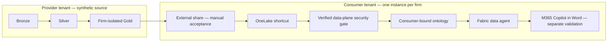

# One ontology, many law-firm tenants

An ISV can publish well-formed tables and still leave a customer's Copilot unable to
explain what a number means. A CFO calls a draft-bill reduction a write-down and an
issued-bill reduction a write-off; a generic join can blur the two. Worse, an agent
can confidently surface a matter from which the asking partner is screened. This
synthetic Microsoft Fabric workshop makes the vocabulary, calculation boundaries,
relationships, and authorization obligations explicit before asking an AI to answer.

The intended pattern is a governed ISV data product, a portable business ontology,
and customer-owned agents. Harbor & Vance LLP and Kestrel Legal instantiate the same
definition against distinct data. An ontology complements—not replaces—a semantic
model and data-plane authorization. Its distinctive contribution here is explaining
*where* value was lost along Adjustment → Proforma → Invoice → Matter → PracticeGroup.

## What this demo shows

Alexandra Reyes is the fictional Harbor & Vance Corporate partner. The five workshop
questions are designed to make both useful reasoning and the limits of a prototype visible.

| Question | Expected answer | Architectural claim |
|---|---|---|
| How much unbilled time is sitting on the Meridian acquisition matter, and how old is it? | Material unbilled WIP aged 60–120 days; separate time from costs and state currency and as-of date. | Shared business measures, not an improvised sum. |
| Which of my matters are over budget this quarter, and by how much? | Castellan tribunal series about 35%; lease renegotiations about 8%; compare fees and hours within the same quarter. | Partner roles, periods, and budgets are explicit. |
| Why did realization fall in the litigation group last month? | Distinguish Vantage proforma write-downs from Redgrave invoice write-offs; compare matched cohorts with the preceding month. An invoice write-off reduces recoverability, not already issued billed realization. | Stage-aware reasoning and no double-counting. |
| Draft a paragraph summarising the billing position on this matter. | A factual Meridian paragraph with as-of date, currency, WIP, billed, collected, outstanding, and citations; no invented amounts. | Contextual drafting grounded in governed definitions. |
| Show me the same thing for the Ashworth matter. | Refuse without revealing financials, narrative, or inferred matter attributes. | Authorization is enforced below the prompt; refusal alone is not proof of a secure data plane. |

Exact reproducible values are calculated from generated data, not hard-coded into
agent answers. The fixed default snapshot is **2026-09-04**; “last month” is August
2026 and “this quarter” starts July 1. Moving the snapshot requires explicit regeneration.

### Numeric demo card — generated snapshot, not an agent transcript

The current [expected-answer fixture](data/expected_answers.json) gives these Harbor
values for Alexandra Reyes's authorized scope. Money is stored as integer cents;
percentages use the fixture's six-place ratios. USD is not combined with GBP.

| Case | Exact default result |
|---|---|
| Meridian — Acquisition of Calder Systems | **USD 432,000.00** negotiated unbilled time; **200 entries / 800.00 hours**, aged **60–120 days**. Standard time value is USD 480,000.00; costs are separate. |
| Castellan — Employment tribunal series | **USD 54,000.00** against USD 40,000.00: **USD 14,000.00 / 35%** over; **135.00 hours** against 100.00. |
| Castellan — Lease renegotiations | **USD 43,200.00** against USD 40,000.00: **USD 3,200.00 / 8%** over; **108.00 hours** against 100.00. |
| Authorized litigation, July → August | Issued realization **87.3180% → 62.9985%**, down **24.3195 percentage points**. August issued net time USD 329,040.95 / standard time USD 522,300.00. |
| August stage attribution | Vantage — Contract dispute: **USD 134,719.20** proforma reductions. Redgrave — Product liability defence: **USD 12,573.79** invoice write-offs; these affect recoverability, not already-issued realization. |
| Meridian billing position | Issued net **USD 218,329.05**, collected **USD 216,167.92**, invoice write-offs **USD 2,161.13**, outstanding **USD 0.00**, draft net **USD 0.00**; unbilled costs **USD 3,238.00** in addition to the time above. |
| Ashworth follow-up | **Denied**; no financial figures, narrative, or inferred attributes may be returned. |

Q1 and the billing card exclude Meridian's child matters and unconverted drafts
from the unbilled-time subtotal. Quarter actuals run July 1 through September 4
inclusive against the **full-quarter** budget, not a prorated plan. Zero issued
receivables can coexist with substantial unbilled work. Meridian's fixed-fee-capped
arrangement means recorded time value is not guaranteed collectible future revenue.

## Architecture and truth boundaries





The [architecture guide](docs/01-architecture.md) and
[Mermaid source](docs/img/architecture.mmd) distinguish implemented core operations
from manual or blocked stages. The portable ontology contains **13 business entities
plus MatterAccess and 7 SQL measures**, not native deployed Fabric measures.

There is an important distinction between the business aspiration and this topology:
external sharing reads provider-hosted data across a tenant boundary. It does **not**
prove that all firm data has always stayed inside the firm's tenant. This repository
uses synthetic provider data only; it contains no provider-side query of customer-owned
operational data. For a strict customer-only residency design, ingest and transform
inside each customer tenant and distribute definitions instead of provider-hosted data.
Microsoft's AI processing region settings also require a separate residency review.

Full isolation for two independent customer tenants requires **three tenants** (provider
plus two consumers). Two tenants support the provider and one external customer, or
two customer workspaces sharing a consumer tenant; the latter proves workspace, not
cross-customer tenant isolation. `--allow-shared-consumer-tenant` means **2 tenants /
3 workspaces**. `--single-tenant-simulation` means **1 tenant / 2 workspaces**, with
**2 separate firm lakehouses in the shared consumer workspace**. Both are weaker
than independent consumer tenants; neither proves partner-level authorization.

## Prerequisites and status

The setup wrappers require **Python 3.11 or newer** and Git.
Live use requires paid **F2 or higher** Fabric capacity in a supported region, capacity assignment
rights, approved deployment identities, separate customer identities, and appropriate
Fabric and Microsoft 365 entitlements for the chosen experience. Attended single-tenant
workshops may explicitly use the signed-in Azure CLI user. F2 eligibility does
not certify ontology/Graph availability. See [the deployment guide](docs/03-deployment-guide.md)
for the permission matrix, tenant settings, preview contracts, and blocking checks.

The target APIs are verified against public Microsoft documentation dated **2026-09-04**.
Local tests and dry-run plans are not a live deployment certificate. External-share
acceptance, authorization compatibility, graph refresh, and Word publishing must not be
represented as automated unless their documented contracts support it. Unsupported
steps stop with a named gap; there is no silent copy or prompt-only security fallback.

## Quickstart

From this repository directory on Windows:

```powershell
./scripts/setup.ps1
./scripts/run_all.ps1 -DryRun
```

On macOS or Linux:

```bash
bash scripts/setup.sh
bash scripts/run_all.sh --dry-run
```

The setup scripts create a local virtual environment and install pinned dependencies.
The run scripts generate data, run tests, and plan the deployment; they **always use
deployment dry-run**, even without the convenience flag. For live execution,
copy `.env.example` to `.env`, configure tenant-owned credentials privately, and run:

```powershell
./.venv/Scripts/python.exe scripts/validate_environment.py --config .env
./.venv/Scripts/python.exe fabric/deploy.py --config .env
```

The dotenv file may set `DEPLOYMENT_TOPOLOGY` and `DEPLOYMENT_THROUGH_STEP`, allowing
these exact commands to retain an explicitly selected topology and supported boundary.

Use `--single-tenant-simulation` only for a clearly labeled workshop simulation. A
preflight that reports UNKNOWN or FAIL is not permission to claim a working live demo.
Full live mode intentionally blocks before resource creation. Explicitly selecting
`--through-step 4` requests supported core preparation only, after local validation
and administrator review; it does not bypass the later sharing and security gates.

## Evaluation: a passing fixture is not a live rehearsal

The harness covers **all 5 canonical questions plus 15 variants per sweep**, using
delegated Harbor identity for live MCP calls. Authorized answers must be JSON text
with a business paragraph, structured secure metrics, and citations. A hidden local
fixture supplies comparison values, not live prompt answers. The strict paragraph
grammar is narrower than a general natural-language judge.

`--dry-run` validates inputs without authentication, network calls, or report writes.
`--offline-self-test` constructs answers from the fixture and labels them
**OFFLINE_NOT_AGENT**; `--responses-jsonl` labels recordings **RECORDED_NOT_LIVE**.
Neither is independent agent evidence. Reports can have `all_passed=true` offline,
but `live_readiness=false` remains mandatory, even after three successful delegated
live sweeps, because raw-graph authorization and portal/Word proof are not certified.
Core steps 1-4 have now completed in the configured single-tenant simulation,
including all four live Spark transformation jobs. Both firms also have live Direct
Lake models, Power BI reports with source-checked financial totals, queryable
ontologies, and ontology-backed data-agent definitions. Harbor is published and its
authenticated MCP endpoint has answered an exploratory query. Kestrel MCP publication,
full delegated evaluation, visual certification, partner authorization, Microsoft 365
Agent Store publication, and Word integration remain incomplete. See the
[analytics deployment status](docs/06-analytics-demo.md) for report links, MCP setup,
reproducible commands, and exact remaining blockers.

## Repository tour

`data-generator/` provides configurable synthetic reference data, deliberately planted
billing cases, and relational invariants. `fabric/notebooks/` contains real PySpark
bronze/silver/gold transformations. `fabric/ontology/` is the portable domain contract;
version-sensitive translation belongs in one adapter. The
[ISV ontology package example](examples/isv-ontology-package/README.md) demonstrates a
versioned Turtle distribution with a generated RDF/XML compatibility artifact.
`fabric/steps/` separates the resource lifecycle into repeatable stages. `agent/` holds
business instructions, rehearsal questions, and a fail-closed evaluation harness.
`docs/` explains architecture, design choices, deployment, delivery, and adaptation;
`scripts/` makes the entry points consistent across Windows and Unix.

## Reuse beyond this workshop

The legal content is separated from reusable deployment mechanics. Names, rates, and
legal scenarios are configurable; a different domain also requires replacing or
extending source schemas, generators, invariants, measures, security, and evaluation.
Keep tenant-aware credentials, REST retries, operation polling, ownership tracking,
and teardown principles. Do not just rename Matter to Order: reconsider each measure's
grain, units, and authorization traversal.

For a field-service example, Client becomes Customer, Matter becomes ServiceContract,
TimeEntry becomes TechnicianVisit, and Proforma becomes ServiceApproval. Preserve the
distinction between a pre-invoice concession and a post-invoice credit. Replace ethical
walls with territory or account access enforced at the data plane. The worked mapping
in [the reuse guide](docs/05-reuse-for-your-own-domain.md) shows those seams.

## Known gaps and manual steps

External data sharing requires recipient acceptance; a same-tenant shortcut is not a
cross-tenant test. Fabric IQ and data agents are preview surfaces. An access relationship
describes policy but does not install row-level security: the deployment has a hard
block **before live raw-Gold binding**. The ontology adapter is implemented, but the
public DataAgent definition lacks an ontology datasource discriminator; a Graph ID
cannot be replaced with an Ontology ID.

Publishing a Fabric agent, publishing it to M365, and demonstrating it in Word are
three different milestones. Microsoft documents M365 publication from **within Fabric**
(portal or SDK in a Fabric notebook), not via a public API outside Fabric; see the
[SDK publication note](https://learn.microsoft.com/en-us/fabric/data-science/fabric-data-agent-sdk#publish-the-data-agent).
An Agent Store listing is not full Word integration evidence. The deployment guide
names each blocker and the full [VERIFY checklist](docs/03-deployment-guide.md#verify-before-running).
A successful local evaluator is never called a live rehearsal.

## Teardown and cost

```powershell
./.venv/Scripts/python.exe fabric/deploy.py --config .env --teardown --dry-run
./.venv/Scripts/python.exe fabric/deploy.py --config .env --teardown
```

Only resources recorded as created by this deployment are eligible for removal.
Pre-existing workspaces must not be deleted. Capacity is not provisioned or deleted by
this repository; **it can continue to incur charges after the demo and after teardown**.
Stop notebook sessions and separately suspend or delete workshop capacity under your
organization's change controls.

## Synthetic data and license

All data is synthetic. No real firm, client, or person is represented; fictional names
may coincidentally resemble real names. Microsoft product names refer to the platform,
not to seed organizations. The project is licensed under [MIT](LICENSE).