# Architecture: portable meaning, tenant-owned consumption

This workshop asks a practical ISV question: how can the same financial vocabulary
support different customers without confusing their data, identities, or accounting
definitions? It implements deterministic synthetic data, provider transformations,
a portable ontology compiler, deployment orchestration, and a conservative evaluator.
It does **not** implement an automatically deployable, security-certified, end-to-end
Fabric-to-Word demo. The last stages are deliberately blocked where the necessary
contract or authorization evidence is missing.

## The business story

All organizations, people, and engagements are fictional. **Harbor & Vance LLP** has
15 clients, 60 matters, 40 timekeepers, and 8,000 time entries. Its demonstration
partner is **Alexandra Reyes**. **Kestrel Legal** has 10 clients, 25 matters, 15
timekeepers, and 2,500 entries, with **Iona Vale** as its first partner. Kestrel has
different names and a different leakage mix, not merely Harbor rows with new IDs.

Harbor's cases include **Meridian — Acquisition of Calder Systems**, instructed by
**Meridian Industrial Group**; **Castellan — Employment tribunal series** and
**Castellan — Lease renegotiations**, for **Castellan Retail Group**; **Vantage —
Contract dispute**, for **Vantage Freight Systems**; and **Redgrave — Product liability
defence**, for **Redgrave Manufacturing**. **Ashworth — Regulatory investigation**,
for **Ashworth Holdings**, is the screened negative test. These names are workshop
fixtures, not information an unauthorized runtime answer is allowed to reveal.

## Three topology choices, three different claims

[Mermaid source](img/architecture.mmd). Solid arrows describe the implemented core
data path, not proof of a cloud run. Dashed arrows mark manual, blocked, or separately
verified stages. Each customer would receive its own physical bindings and agent.

| Mode | Tenants | Workspaces | Isolation claim |
|---|---:|---:|---|
| Default full topology | **3**: provider + Harbor consumer + Kestrel consumer | **3**: one per tenant | Intended independent customer-tenant boundaries; live enforcement still requires validation. |
| `--allow-shared-consumer-tenant` | **2**: provider + shared consumer | **3**: provider + two consumer workspaces | Workspace isolation only; not two independent customer tenants. |
| `--single-tenant-simulation` | **1** | **2**: provider + shared consumer | Same-tenant workshop only; the consumer workspace holds **two separate firm lakehouses**. |

The shared-consumer tenant must differ from the provider. In simulation all three
configured identities belong to the same tenant, the two consumer capacities and
adopted workspace IDs must agree, and Harbor owns the shared workspace lifecycle.
The Kestrel principal still needs explicit permissions. Broad workspace roles in
this mode can expose both firm lakehouses; separate lakehouses do not establish
partner-level authorization. External invitations are not applicable within the
provider tenant, so simulation uses ordinary OneLake shortcuts instead.

## Data flow and residency

The local generator writes 18 Parquet tables per firm, an explicit schema, a manifest
with hashes and row counts, and [expected answers](../data/expected_answers.json).
Seed **42** and snapshot **2026-09-04** are the defaults. The service window begins
2025-03-04. The manifest is the run boundary: consumers of local artifacts read its
members, not a recursive directory wildcard. Regeneration must not race deployment
or evaluation.

Provider Bronze receives the synthetic Parquet, schema, and manifest; the multi-firm
expected-answer fixture is never uploaded. The
[Bronze-to-Silver template](../fabric/notebooks/01_bronze_to_silver.ipynb) uses explicit
schemas and firm-prefixed Delta tables. The
[Silver-to-Gold template](../fabric/notebooks/02_silver_to_gold.ipynb) retains exact
source columns, projects ontology aliases, and materializes filtered relationship
tables. Provider Gold is physically separated into `gold_harbor` and `gold_kestrel`.
Both templates contain actual PySpark transformations. Static template checks and
definition compilation are not equivalent to executing Spark in Fabric.

Step 04 injects a JSON configuration string into a copied notebook definition in
memory, including the manifest snapshot, schema, contract, firm, and absolute ABFSS
locations. Four firm/stage notebook items run in the provider workspace. Consumers
are intended to read approved firm Gold tables through accepted external shares,
with shortcuts in `harbor_data` or `kestrel_data`; no copy fallback is supplied.

**Provider-hosted synthetic data crosses a tenant boundary when read.** This design
cannot support a claim that source data “never leaves the customer tenant.” External
sharing avoids a mandatory intermediate copy, not cross-tenant data access. Provider
governance does not automatically transfer to consumers, and recipient governance,
export controls, AI processing, conversation storage, and M365/MCP handling need
separate review. A strict customer-resident variant would ingest and transform inside
each customer tenant and distribute definitions only; that is a different ingestion
topology, not a claim about this implementation.

## What is portable

The [YAML contract](../fabric/ontology/ontology.yaml) contains **13 business entities
plus MatterAccess**, relationships, and **7 portable measures**: `unbilled_wip`,
`wip_age_days`, `realization_rate`, `collection_rate`, `days_sales_outstanding`,
`leakage`, and `budget_variance`. Matter distinguishes responsible, billing, and
originating partners. A parent matter neither absorbs a child's balances nor grants
access to it implicitly.

The [adapter](../fabric/ontology_adapter.py) expands and validates YAML, creates
documented ontology definition parts, assembles parameterized measure SQL, and
produces a business guide for agent instructions. Logical entity/property/relationship
IDs are tenant-independent; binding IDs depend on the target workspace and lakehouse.
Gold evaluates expressions against original rows and binds concrete projected columns.
Filtered edge tables express nullable/stage-specific business links, not security.

Portable measures are **not native deployed Fabric ontology measures**. The public
definition has no corresponding measure DSL, so measure SQL remains in the portable
contract and instructions. Entity, property, and relationship descriptions now use
the documented native `semanticEnrichment` metadata.
Financial arithmetic uses integer cents and decimal accumulation in Gold; the public
graph's Double projection is not an exact-money calculation engine. Always group
money by firm and currency: USD and GBP are not added without an explicit FX model.

An ontology complements a semantic model. A semantic model remains useful for
governed BI measures and reporting; the ontology adds reusable concepts, explicit
relationships, and traversal context. Neither eliminates the need for independently
enforced data permissions. See [ontology design](02-ontology-design.md) for the
contract details and [reuse](05-reuse-for-your-own-domain.md) for a worked mapping.

## Following financial leakage without changing realization

[Mermaid source](img/leakage.mmd). Each positive Adjustment belongs to exactly one
stage and one corresponding target. Follow Adjustment → TimeEntry or Proforma →
Invoice → Matter → PracticeGroup as appropriate; do not duplicate an adjustment by
joining it to every underlying entry.

Issued realization is **issued net time fees / standard time value for the same
issued-invoice cohort**, excluding costs. Negotiation gaps, time-entry reductions,
and proforma write-downs affect that ratio. Invoice write-offs (bad debt in this
synthetic model) reduce recoverable fees and receivables **after issue**; they do not
rewrite issued net fees. Thus Redgrave's bad debt cannot be described as a cause of
lower already-issued billed/standard realization. A separate recoverable-time ratio
can reflect it. Payments then reduce outstanding receivables, not issued realization.

For authorized Harbor litigation, July issued realization is **87.3180%** and August
is **62.9985%**, a **24.3195 percentage-point decline** using the fixture's six-place
ratios. August issued fees are **USD 329,040.95** against **USD 522,300.00** standard
fees. Its reductions are **USD 4,700.70** at time-entry stage, **USD 136,328.35** at
proforma stage, and **USD 15,235.51** at invoice stage. Within that cohort, Vantage's
proforma reductions are **USD 134,719.20**, whereas Redgrave's invoice write-offs
are **USD 12,573.79**. They tell different parts of the financial story.

“Last month” means August 2026, compared with July, using invoice issue dates and
adjustments recognized through the fixed snapshot. Quarter actuals run July 1 through
September 4 inclusive against the full July–September budget. A different as-of date
requires a complete regenerated snapshot, not a wall-clock substitution. Q1's
unbilled-time subset excludes costs and unconverted drafts; portable `unbilled_wip`
also includes eligible draft time and recoverable costs. Match scope before reconciling.

## Authorization is a binding prerequisite

The intended policy is default deny, explicit same-firm grants, and screen-overrides-
grant. `MatterAccess` preserves both grant and screen records. A direct Timekeeper →
Matter access relationship is informational adjacency and **not enforcement**.
Trusted caller identity, not prompt text or a provider application token, determines
the authorized matter set before aggregating or returning narratives and citations.

Step 07 has a **hard block before live binding**:
`RAW_GRAPH_SECURITY_VALIDATION_REQUIRED`. No environment boolean overrides it.
Before any confidential raw Gold binding, validate actual caller propagation and
deny behavior across direct OneLake, SQL, shortcuts, graph materialization, refresh,
caches, and agent queries. Screened rows must not affect totals or leak through names,
narratives, citations, inferred attributes, or parent/child traversal. The local
security helpers demonstrate the desired policy; they do not install Fabric RLS.

External-share creation/acceptance is manual and its opaque shortcut target cannot
certify source binding. The public agent definition lists `graph` but no `ontology`
source discriminator; those artifact IDs are not interchangeable. Product documentation
can describe ontology consumption while the public deployment payload remains a gap.
The adapter therefore raises `UnsupportedCapability` rather than silently creating
a lakehouse-backed substitute or an empty “grounded” agent.

## Evaluation and publication are separate evidence layers

The [evaluator](../agent/evaluate.py) runs **all 5 canonical questions plus 15
variants** on each sweep, including screened, cross-tenant, undefined-measure, and
follow-up probes. Live mode uses Harbor's delegated device-code identity and the
published agent's MCP endpoint. It discovers the tool through MCP rather than posting
an invented chat payload. Application-token success is not a partner evaluation.

Authorized responses must be JSON text with `answer`, structured `facts`, and
`citations`. The current grader has a deliberately strict paragraph grammar and can
reject otherwise reasonable paraphrases. It checks secure metrics and IDs against a
local expected-answer fixture; those financial answers are hidden from live prompts.
This is not an independent agent judge. Offline self-test answers are constructed
from that same fixture, so a passing report proves harness consistency, not reasoning
or live security. Recordings are labeled separately from live calls. Reports retain
hashes, timing, identity metadata and safe failure codes, not raw answers or tokens.

`all_passed` can be true offline; `live_readiness` remains **false**, even after three
passing delegated live sweeps. Graph security and portal/Word proof remain separate.
Publishing a Fabric agent enables its supported runtime; publishing it to M365 does
not demonstrate Word integration. Microsoft documents M365 publication from within
Fabric (portal or SDK in a Fabric notebook), **not a public API for that operation
outside Fabric**. A same-tenant, same-account M365 session, approved agent visibility,
actual Word availability, and preserved citations must each be checked.

The [deployment guide](03-deployment-guide.md) is the source-linked checklist for
tenant switches, capacity/region checks, every API contract used here, known blockers,
recovery, and cost-safe teardown. It intentionally distinguishes implemented local
artifacts, documented cloud operations, and independently verified live behavior.