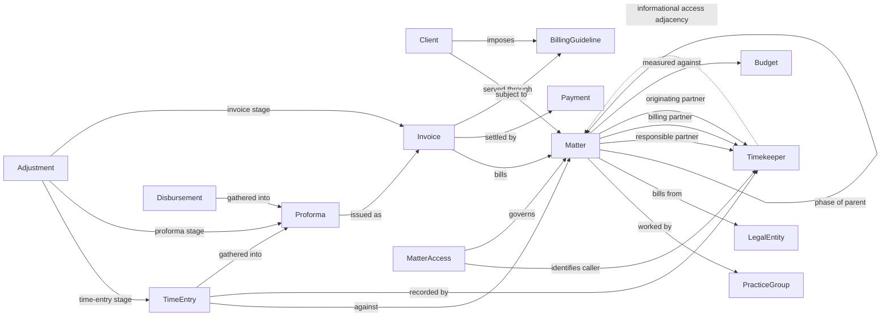

# Legal financial ontology: portable semantics, honest deployment boundaries

The ontology follows a legal engagement from client to matter, recorded work, draft
review, issued invoice and applied cash. Matter anchors both business context and
authorization. Three partner roles distinguish delivery responsibility, billing
ownership and origination credit. Those roles must not be collapsed merely because
one person sometimes holds more than one of them.

The source of truth is [ontology.yaml](../fabric/ontology/ontology.yaml), with
[one file per entity](../fabric/ontology/entities/matter.yaml),
[relationships](../fabric/ontology/relationships.yaml),
[seven measures](../fabric/ontology/measures.yaml) and
[security semantics](../fabric/ontology/security.yaml). This is a **portable business
contract**, not an undocumented Fabric measure language. The only public API encoding
is in [ontology_adapter.py](../fabric/ontology_adapter.py).

## What is modeled

| Entity | Business meaning and important distinctions |
|---|---|
| Client | The organization instructing the firm; its relationship partner is not automatically any matter's partner. |
| Matter | A separately managed and billed engagement; responsible, billing and originating partners remain distinct. |
| Timekeeper | The person recording work, with standard rate, currency, grade, office and department. |
| PracticeGroup | The legal discipline delivering work; group leadership is not an access grant. |
| LegalEntity | The jurisdictional billing entity and its functional currency. |
| TimeEntry | Dated negotiated work, retaining exact standard and negotiated cents and its phase. |
| Disbursement | Dated costs; recoverability determines billable WIP, not fee realization. |
| Proforma | A reviewed draft, whose net value includes costs and reductions; not a second bill after conversion. |
| Invoice | The issued bill and its immutable net fees; issue month defines realization and collection cohorts. |
| Payment | One application of cash to one invoice, including partial settlement. |
| Adjustment | One positive fee reduction at exactly one stage and exactly one corresponding target. |
| Budget | Full-quarter approved fees and hours for one matter, phase and currency. |
| BillingGuideline | A client rule with threshold units, currency and an explicit effective interval. |
| MatterAccess | An additional reified access decision carrying `granted` or `screened`. |

The thirteen required business entities are all present. The fourteenth is intentional:
the public relationship definition cannot carry `access_type`. Reifying the access
record prevents losing the difference between a grant and an ethical-wall screen.



Natural-language labels and cardinalities live in YAML and the generated agent guide.
Public relationship `name` values are stable identifiers satisfying the documented
name pattern, not prose with spaces. Every relationship specifies its binding table,
source key column and target key column directly. No join inference is needed to
construct contextualizations. Additional relationships expose client relationship
partners, practice heads, draft reviewers and adjustment approvers.

## Contract and Gold notebook integration

`load_contract(path)` accepts the root YAML path or its containing directory and
returns a JSON-compatible `dict`. Root keys are `version`, `name`, `description`,
`entities`, `relationships`, `measures`, `measure_context`, `security` and `gold`.
`entities`, `relationships` and `measures` are **lists**, not dictionaries of filenames.
The loader expands references, rejects duplicate YAML keys and normalizes source
aliases into expressions.

The following is an illustrative excerpt of the expanded JSON, showing the exact
entry shapes consumed by the notebook; the actual contract contains all fourteen
entities and all seven measures:

```json
{
  "version": 1,
  "entities": [
    {
      "name": "Client",
      "table": "clients",
      "key": "client_id",
      "display_name": "name",
      "description": "The organization instructing the firm.",
      "properties": {
        "client_id": {"column": "client_id", "type": "string"},
        "name": {"column": "name", "type": "string", "expression": "`client_name`"}
      }
    }
  ],
  "relationships": [
    {
      "name": "MatterPhaseOfParent",
      "label": "A sub-matter is a phase of a parent matter, but bills and access remain separate.",
      "cardinality": "many-to-zero-or-one",
      "source": "Matter",
      "target": "Matter",
      "table": "matters",
      "source_column": "matter_id",
      "target_column": "parent_matter_id",
      "filter": "parent_matter_id IS NOT NULL",
      "edge_table": "edge_matterphaseofparent"
    }
  ]
}
```

`key` and `display_name` reference **property names**, not descriptions or arbitrary
SQL. Each property has `column`, a Spark `type`, and optional SparkSQL `expression`.
In authored YAML, `source_column` is an alias shorthand; the loader converts a
different source column into a backtick-quoted expression. The notebook need not
understand `source_column` after loading.

For each entity, read its source table, evaluate all expressions against the
**original row**, cast to the declared Spark type and alias to `column`. Without an
expression, project the column itself. Retain all original SPECS columns, replacing
rather than duplicating any same-name column. Do not build an alias in one step and
then make another expression depend on that new alias. The supplied expressions do
not require such ordering. For example, `draft_value` divides original `net_cents`,
not the newly aliased `draft_value_cents`.

The source schema is defined in
[common.py](../data-generator/generators/common.py) and emitted as an explicit Spark
schema by [storage.py](../data-generator/generators/storage.py). Do not infer types
from nullable rows. Carry the manifest snapshot date separately, unchanged across
all tables in a run.

### Required source extensions: do not fabricate missing business fields

The original SPECS lack the following source fields. They are explicit generator
integration requirements in `gold.new_source_fields`; the adapter does not create
dummy values or imply they were already present:

| Source table | Additional original-row fields required |
|---|---|
| clients | `industry`, `relationship_partner_id`, `credit_status` |
| practice_groups | `group_head_id` |
| legal_entities | `jurisdiction` |
| timekeepers | `grade`, `office`, `department` |
| time_entries | `rate_cents`, `billable_flag`, `phase` |
| disbursements | `type`, `vendor`, `recoverable_flag` |
| proformas | `reviewer_id` |
| invoices | `ebilling_status` |
| adjustments | `reason_code`, `approver_id` |
| budgets | `phase` |
| billing_guidelines | `rule_type`, `threshold`, `effective_from`, `effective_to` |

Use strings for identifiers, grades, labels, status, phase and reason codes; boolean
flags; a long for `rate_cents`; dates for effective boundaries; and
`decimal(18,2)` for `threshold`. `rate_cents` is the exact selected rate from
`rates.hourly_rate_cents`, not a floating-point reconstruction from rounded value
divided by hours. Office and department should be human-readable source labels,
not invented names for IDs. Reference IDs must point to same-firm timekeepers.

Business numbers (`client_number`, `matter_number`, `proforma_number`,
`invoice_number`) and practice/entity codes intentionally alias the existing stable
synthetic IDs. They are not claims that a production system uses IDs as its visible
numbers. `period` derives from preparation month for proformas and quarter bounds
for budgets. `Adjustment.type` derives from stage; `reason_code` does not.

Threshold units must agree with `rule_type`: days for payment terms, major currency
units for a fee cap. The exact `fee_cap_cents` remains available. Effective intervals
are start-inclusive/end-exclusive unless the source explicitly states otherwise.
Invoice-to-guideline applicability and compliance come from the existing
`invoice_guidelines` bridge, which must also remain in Gold even though it is not
one of the fourteen entity tables. It is listed in `gold.passthrough_tables`.
`required_gold_tables(contract)` returns the sorted union of entity, bridge and
filtered edge tables for Gold materialization and recipient sharing/shortcut plans.

### Filtered relationship tables

Public contextualizations have no SQL predicate field. Consequently a nullable FK
or stage-specific target must be filtered in Gold, not passed as an invented REST
`filter` property. `relationship_projections(contract)` returns:

```json
[
  {
    "name": "MatterPhaseOfParent",
    "source_table": "matters",
    "table": "edge_matterphaseofparent",
    "filter": "parent_matter_id IS NOT NULL",
    "columns": ["firm_id", "matter_id", "parent_matter_id"]
  }
]
```

This is an excerpt; the helper returns every filtered relationship. After entity
aliases exist, filter `source_table` with the supplied SparkSQL predicate, select
`columns` and materialize `table` in the same Gold lakehouse. Apply the filter
**before** selecting columns because adjustment filters also inspect the other two
nullable targets. Make these edge tables part of sharing/shortcut configuration,
not just provider-local artifacts. Their names must match the consumer bindings.

For a caller iterating relationships directly: `relation['table']` is the base
source; `relation.get('filter')` signals the need for a projection; write it to
`relation['edge_table']`. The adapter binds `edge_table` when present, otherwise
`table`. No extra projection is required for unfiltered relationships. Do not
rename the base table in place.

Before publishing Gold, validate nonnull/unique entity keys, same-firm foreign keys,
acyclic parent links, one corresponding target per adjustment stage, positive
adjustment cents, valid payment chronology, matched payment/invoice currency and
matter, and unique budgets per matter/quarter/phase/currency. Source validation
must reject malformed adjustments; filtering their edges is not a license to
silently drop bad financial records. Do not duplicate a whole-matter budget across
phases: use one genuine `all` phase on both plan and activity, or partition both
consistently. Neither `all` nor a parent's grant is an implicit wildcard.

## Financial definitions and comparisons

All queries use `manifest.as_of` as `:as_of`, never today's wall-clock date. They
operate on one daily snapshot; snapshot status cannot reconstruct an earlier
ledger. Work/cash recognition is through the snapshot inclusive. Invoice-issued
cohorts are calendar-month start-inclusive/end-exclusive. Bind every parameter in
`measure_context.parameters`, including `NULL` for optional matter, practice and
responsible-partner filters. Caller identity parameters come from a trusted context,
not from a user's message.

`build_measure_sql(contract, name)` assembles a complete SparkSQL statement with
security-scoped common CTEs and the measure's query. Pass named parameters separately
to the execution layer; never interpolate identity values into SQL. This adapter
does not execute SQL or deploy views. `build_measure_sql(..., 'leakage',
comparison=True)` selects the issued-cohort stage/reason comparison rather than
total recognized leakage. Every other metric uses its normal query for comparison.

| Measure | Definition and grain | Comparison rule / original golden |
|---|---|---|
| `unbilled_wip` | Billable negotiated entry cents plus recoverable cost cents, anti-joined to issued invoices; matter/currency/snapshot. Includes unconverted drafts, before review reductions. | Original `aged_wip` uses only status `unbilled`, excluding drafts. Match subsets; never label different totals a reconciliation failure. |
| `wip_age_days` | Snapshot minus work date for each unissued billable time entry, including draft allocations. | State whether minimum, maximum, simple mean or value-weighted mean is reported. Costs are not time-entry ages. |
| `realization_rate` | Sum issued `net_time_cents` / sum same-cohort `standard_time_cents`; practice/issued month/currency. Costs excluded. | Matches issued pre-bill realization with identical authorization/scope. Compare adjacent complete issue months, not work months. |
| `collection_rate` | Matched cash through snapshot / original issued net of the same issue-month cohort, including costs. | Preaggregate applications by invoice; do not multiply billed value with a one-to-many payment join. Disclose cohort maturity. |
| `days_sales_outstanding` | Unweighted average calendar days from issue to each positive cash application; issued month/currency, application observations. | This is the user's cash-application-delay metric, **not standard sales DSO**. No observed cash means NULL; report count. |
| `leakage` | Positive reductions split by stage and reason, each adjustment once; matter/currency at snapshot. | Issued-cohort variant follows exclusive targets and divides stage/reason loss by the **whole matched cohort's** standard fees, not only adjusted invoices. |
| `budget_variance` | Quarter-to-snapshot negotiated fee/hour actuals minus full-quarter plan for same matter/phase/currency. | Original golden is whole-matter responsible-partner scope. Match phases and retain both hours and fees; costs and reductions excluded. |

Money stays signed int64 cents in Gold, with decimal accumulation in SQL. Exposed
decimal aliases divide cents by 100 rather than replacing exact columns. Null or
zero denominators return undefined ratios, not fabricated zeros. Ratios at coarser
grain must be recomputed from summed numerator and denominator, not averaged.
All monetary results are partitioned by firm and explicit currency; no exchange
rate or cross-currency total is implied.

### Explaining a realization decline without changing the definition

Negotiation gap is standard time less negotiated gross time. Time-entry review
reductions then reduce proforma gross; proforma write-downs reduce issued net fees.
The issued realization numerator already includes those pre-issue reductions.
Invoice-stage write-offs occur later and reduce collectible receivables, not the
original issued net time numerator. Adding them to proforma discounts would count
different economics as one number and misexplain why issued realization fell.

For the comparison, traverse each adjustment's single target to its eventual
invoice, then invoice → matter → practice group. Restrict to the same issued-month
cohort and currency as the realization denominator, recognizing adjustments through
the dataset snapshot. Draft-only reductions have no issued cohort yet. Compare
stage/reason rates between months, separating pre-issue realization losses from
post-issue recoverability losses. Do not claim that invoice write-offs alone caused
a fall in issued billed/standard realization.

### Why the generator's 95-day DSO is a different measure

[expected.py](../data-generator/generators/expected.py) defines the planted Solace
95-day golden as collectible accounts receivable divided by net 90-day credit
sales, multiplied by 90. That is a sales-DSO formula. The requested ontology measure
is instead average issue-to-cash-application delay. Solace has no cash applications
in the current planted case, so its application-delay mean is undefined, **not 95**.
Neither outstanding invoice age nor a sales-DSO golden may substitute for this mean.

## Access semantics are first-class, but not enforcement

The original `matter_access.effect` values map `grant` → `granted`; any other value,
including `deny`, unknown and null, maps to `screened`. Concurrent grant and screen
records are retained; screen wins. `MatterAccess` carries `access_type`, links to its
timekeeper and matter, and preserves evidence of both decisions.

The direct Timekeeper → Matter relation is informational adjacency. It can include
both granted and screened decisions and is **not** a view of effective grants.
Its portable attributes are retained in YAML and the guide, never fabricated in
public relationship JSON. Similarly, invoice compliance is a boolean on the Gold
bridge; relationship existence says a rule applies, not that the invoice passed it.

The security SQL is an explicit-grants-minus-screens policy for a known
`(firm_id, timekeeper_id)` identity. All business CTEs join authorized matters before
any aggregate. A single matter excludes children unless an explicitly authorized
rollup is requested. Unavailable and denied matters use the same non-revealing
response. Client/practice totals, narrative search, citations and relationship
traversals must not reveal screened rows indirectly.

**Neither prompts, workspaces nor access edges deploy partner-level row security.**
Validate actual identity propagation and denied-row noninterference through direct
OneLake/SQL access, shortcuts, ontology traversal and the chosen agent runtime before
binding confidential Gold. Access records and filtered edge tables themselves are
sensitive. A broad service identity plus a prompt instruction is not enforcement.
The existing deployment security gate must remain closed until those live proofs
exist; this adapter deliberately does not override it.

## Public Fabric encoding and unsupported capabilities

The implementation follows the documented
[ontology item definition](https://learn.microsoft.com/en-us/rest/api/fabric/articles/item-management/definitions/ontology-definition)
and [Data Agent item definition](https://learn.microsoft.com/en-us/rest/api/fabric/articles/item-management/definitions/data-agent-definition),
checked 2026-09-07. Preview service acceptance still needs tenant verification.

`build_ontology_definition(contract, workspace_id, lakehouse_id, display_name)`
returns exactly `{"parts": [...]}`. Each part has `path`, a UTF-8 JSON Base64
`payload`, and `payloadType: "InlineBase64"`. Put this object in the caller's
create/update `definition`; it is not the entire item request.

The required platform metadata contains only type `Ontology` and display name;
the root definition is empty. Each entity definition carries its ID, namespace
`usertypes`, namespace type `Custom`, name, key/display property IDs, visible flag,
properties and an empty timeseries list. Non-time-series bindings map materialized
Gold column names to property IDs, using a LakehouseTable source with workspace,
item and table. No `sourceSchema` is sent for this non-schema lakehouse contract.

Entity, property, and relationship definitions carry descriptions through the
documented `semanticEnrichment` field. Relationship definitions also contain ID,
namespace, namespace type, name, and source/target entity IDs. Their contextualizations
identify the physical edge table and bind its columns to endpoint key property IDs.
SQL predicates, cardinality, measure DSL, and relationship attributes are not inserted
as invented public fields. JSON discriminator order is preserved for the preview importer.

Entity, property and relationship IDs are stable positive signed-64-bit strings
derived from names with SHA-256 and checked for collisions. Property identity is
scoped by entity name. Logical IDs deliberately exclude tenants, workspaces and
lakehouses. Physical binding IDs use UUID5 with workspace/item/name scope, so two
tenants share logical definitions without sharing bindings. Renaming a logical
entity/property/relationship changes identity and requires deliberate migration;
changing a physical column mapping does not.

Public properties support only String, Boolean, DateTime, Object, BigInt and Double.
The adapter maps Spark strings/booleans/dates/timestamps/integers accordingly;
Spark decimal and floating-point properties map to Double. **Double is not exact
decimal money**, and large integers converted to doubles lose precision above
$2^{53}$. Use the separately exposed BigInt cents and Gold decimal SQL for financial
reconciliation; decimal aliases are convenient display/query values, not an exact
graph-arithmetic promise. Hours and guideline thresholds have the same Double
projection limitation. Validate value ranges against Gold decimal projection types.

### Agent helpers and the deliberate capability block

`build_agent_instructions(contract, instructions)` returns the supplied text plus
the complete portable entity descriptions, mappings, relationship labels,
cardinalities/attributes, measures, SQL context and security semantics. These
definitions are readable metadata for an explicitly supported integration. They
are **not native deployed ontology measures**.

`build_agent_definition(contract, workspace_id, ontology_id, instructions)` raises
`UnsupportedCapability`, a `ValueError` subclass. The documented datasource enum
includes `graph`, which means a **GQL graph datasource**, but has no ontology value.
Substituting an Ontology item ID into a graph datasource is invalid. No fake
grounding, silent fallback or successful publish is returned.

The separate, explicit `build_agent_draft_definition(contract, instructions)` helper
returns only the two documented required configuration parts: the overall agent
schema and a draft stage containing `aiInstructions`. It contains no datasource or
published stage and is **not a working ontology-grounded agent**. The blocking
helper never invokes it as a fallback. Any later ontology integration must be
verified in the target tenant and implemented in an explicit versioned adapter,
potentially after inspecting a tenant-exported definition and its supported schema.
An export alone does not establish a documented, portable API contract.

## Verification status

[test_ontology.py](../tests/test_ontology.py) covers the fourteen expanded entities,
required properties, original-or-declared source fields, valid relationship columns,
decoded public shapes, endpoint property IDs, tenant-stable logical IDs, UUID5
bindings, filtered edge plans, all seven measure definitions and agent blocking.
It also checks that no unsupported metadata enters a public ontology payload.

These are offline contract tests, not live Fabric, Spark financial-result or security
proofs. During this scoped change, no Python commands or tests were run; the parent
workflow owns test execution and Gold notebook integration. Complete source
extensions, materialize and validate Gold/edge schemas, run the parent tests and
Spark reconciliation, then satisfy the live security/capability gates before
claiming a deployed end-to-end demo.